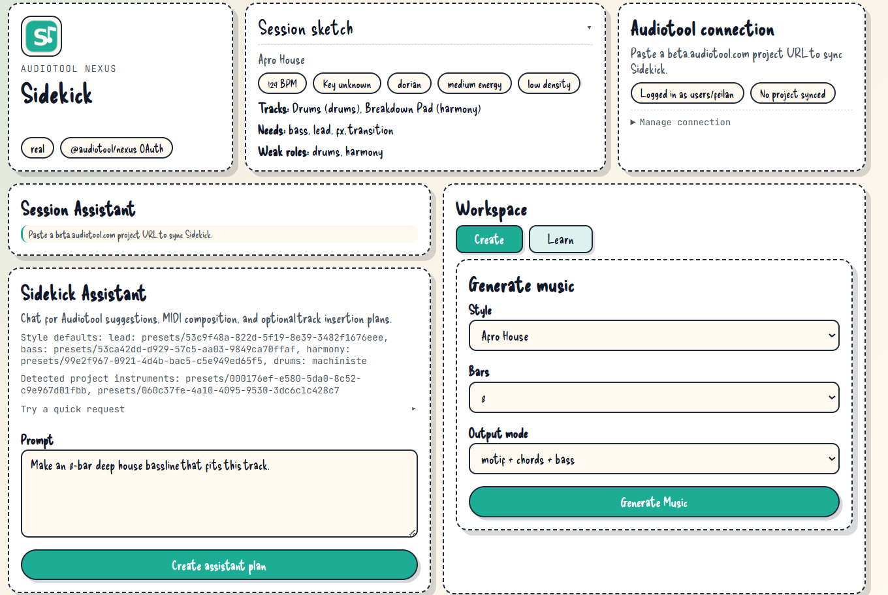
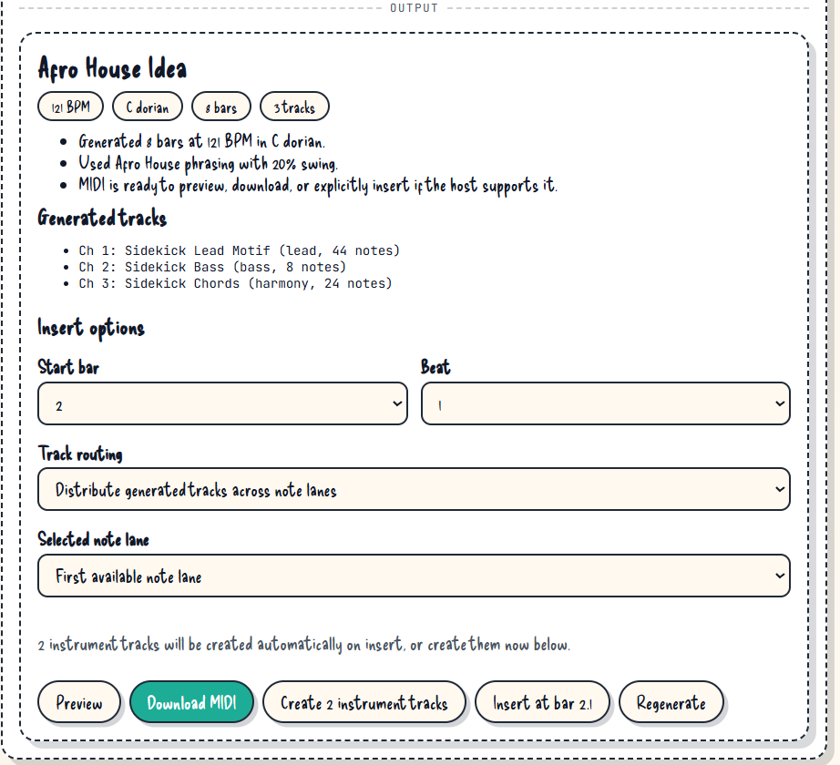
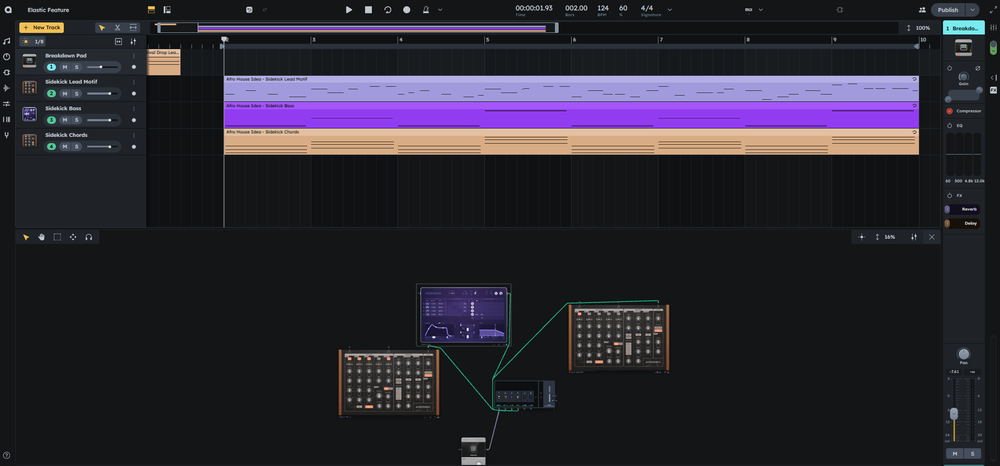
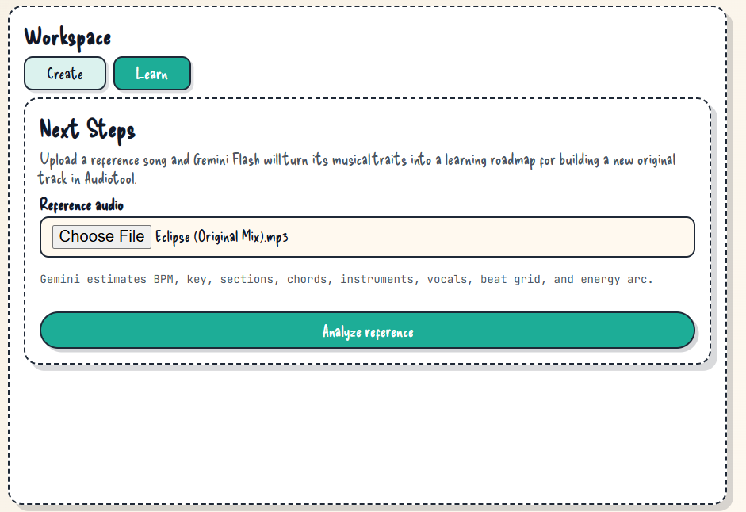
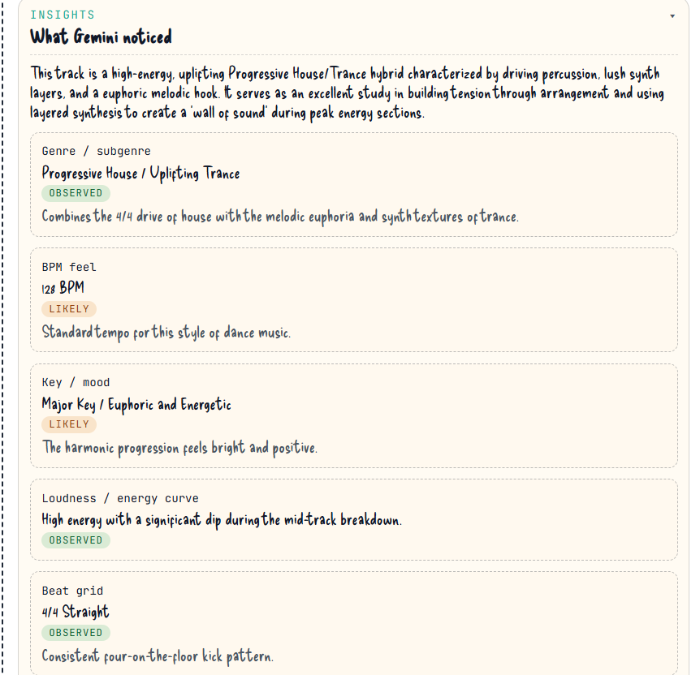
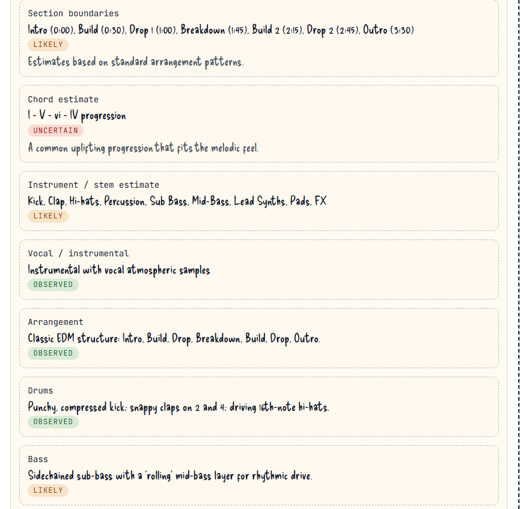
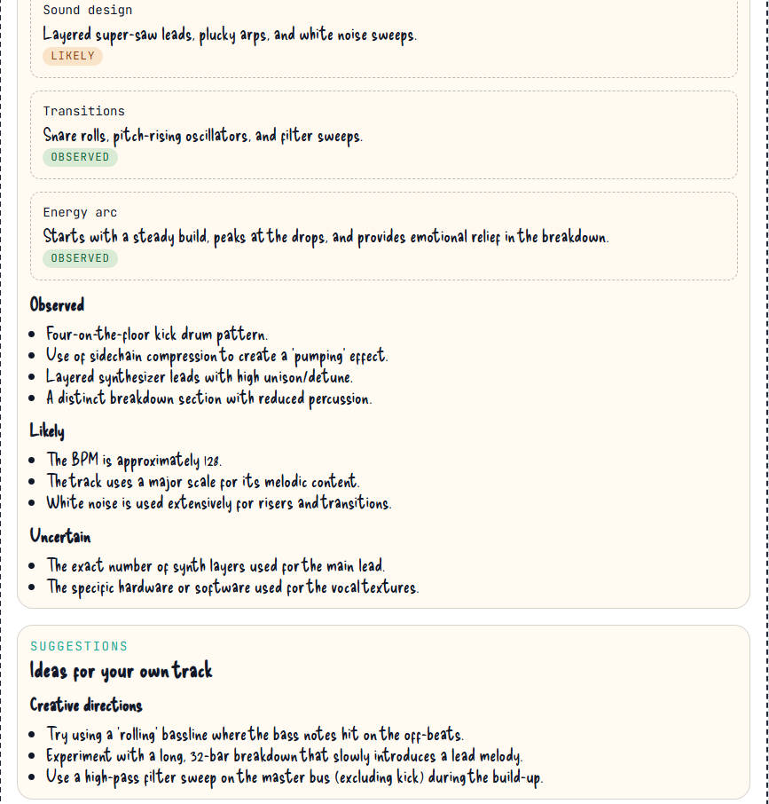
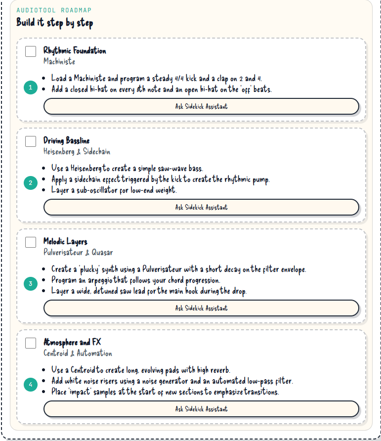
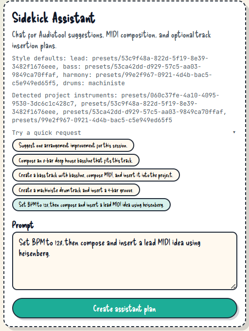
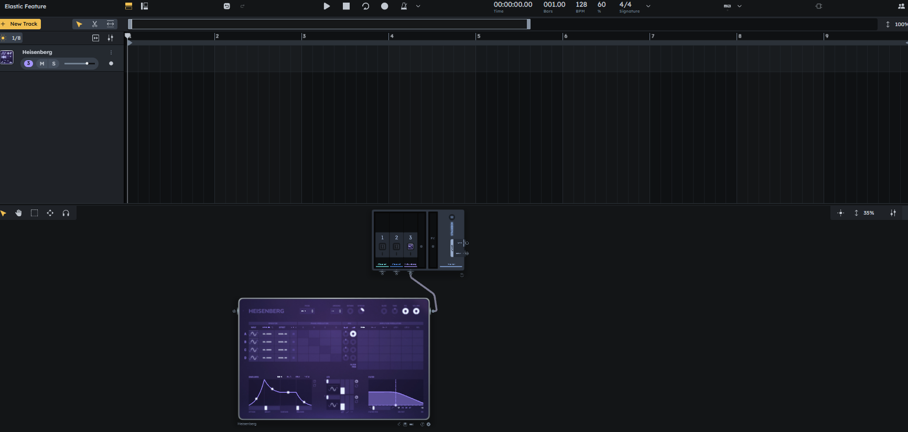

# Sidekick

Sidekick is your music production helper for Audiotool.

It gives producers a quick "kick" of inspiration by generating MIDI ideas, learning from reference songs, and offering an assistant that can help shape the project.

## What Sidekick Can Do

### 1. Create Song Ideas Fast (Around 10 Genres)

From the main UI, you can quickly create bits of songs to spark ideas.



Sidekick generates a MIDI composition and lets you add it directly into your current Audiotool project.




### 2. Learn From Existing Songs

Upload a reference track and Sidekick analyzes it.



You get practical insights such as BPM, rhythm feel, and structure, plus detailed analysis views.





It can also suggest next steps so you can create something similar in your own style.



### 3. Use the Sidekick Assistant for an Extra Push

If you need a higher "kick", the assistant can help add instruments, add tracks, modify parts of your project, and give contextual suggestions.




## Quick Start

1. Install dependencies:

```bash
npm install
```

2. Start the app:

```bash
npm run dev
```

3. Open the URL shown in terminal (usually `http://localhost:5173`).

## Deploy To GitHub Pages (online branch)

This repo includes a workflow at `.github/workflows/deploy-pages.yml`.

How it works:

1. Push changes to branch `online`.
2. GitHub Actions builds the app with `VITE_BASE_PATH=/Sidekick/`.
3. The `dist` output is deployed to GitHub Pages.

One-time repository setting:

- In GitHub, go to **Settings -> Pages**.
- Set **Source** to **GitHub Actions**.

After deployment, your app will be available at:

- `https://barriletechapin.github.io/Sidekick/`

## Gemini On Static Hosting (for testers)

GitHub Pages is static, so there is no server-side `/api/gemini/*` proxy there.

To test Gemini features online:

1. Open the app.
2. Use the **Gemini Access** panel.
3. Paste a personal Gemini API key and click **Save key**.

Notes:

- The key is stored only in that browser (local storage).
- Use **Remove key** to clear it.
- Without a key, chat falls back to local planning and Next Steps cloud analysis is disabled.

## Optional: Connect to Audiotool

If you want full Audiotool integration, create a local `.env` based on `.env.example` and set your own values.

Important values:

- `VITE_AUDIOTOOL_CLIENT_ID`
- `VITE_AUDIOTOOL_REDIRECT_URL`
- `GEMINI_API_KEY` (server-side only)

## Scripts

- `npm run dev` - start local dev server.
- `npm run build` - type-check and build.
- `npm run test` - run tests.
- `npm run lint` - lint code.

